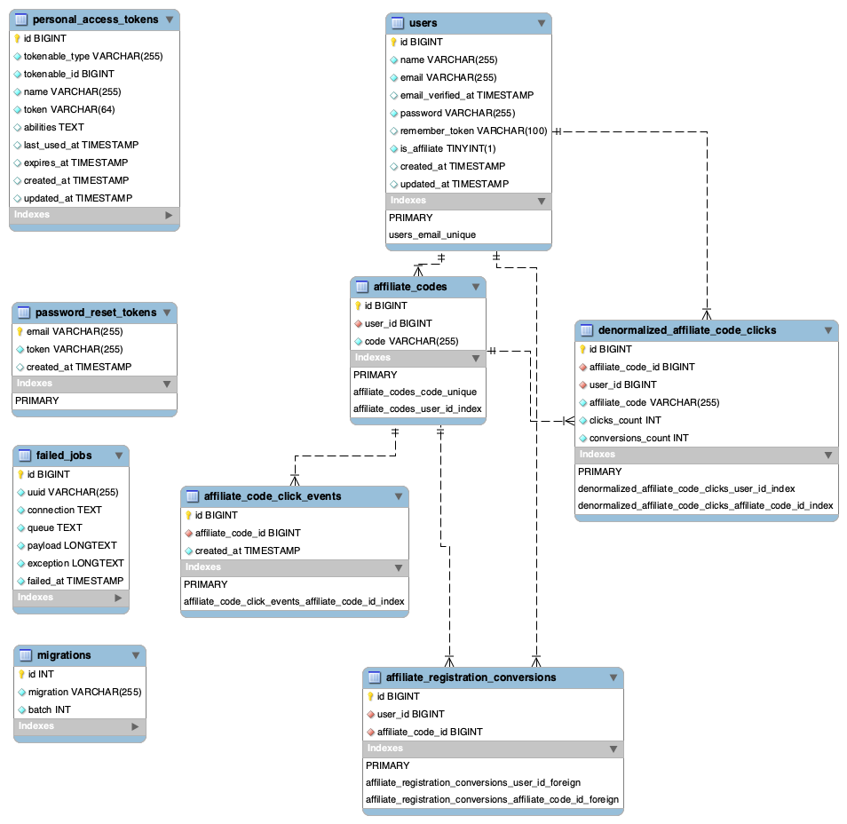

## Brief description and instructions to run project

Project is built on top of Laravel 10. It has been spin up using Laravel Sail
and Docker. To run the project, you need to have Docker installed on your machine.
Please read more here of how to user Sail: https://laravel.com/docs/10.x/installation#docker-installation-using-sail


### Some useful commands to get started:

- git clone repo.bundle click-track-comission

- copy example .env.example to .env

- ```
  docker run --rm \
    -u "$(id -u):$(id -g)" \
    -v "$(pwd):/var/www/html" \
    -w /var/www/html \
    laravelsail/php83-composer:latest \
    composer install --ignore-platform-reqs`
  ```
  
- `./vendor/bin/sail up -d`

- `sail artisan key:generate`

- `npm install`

- `npm run build`


Make sure that you migrate and seed the database. 
You can do that by running `sail artisan migrate --seed`
The seed will create preexisting data for the project to work for demonstration purposes.

Make sure that you run `sail artisan queue:work` to process the queue of the project as we are using this feature to update statistical data.

Statistics page is available at `/statistics` route.
Please note that the inner statistics pages uses Redis cache to store calculated statistical data on server side and
also the all statistics pages might be saved in your browser cache and any proxy between for short period of time.


To run automated tests, please run `sail artisan test`

There are many improvements to be made to the project, but due to time constraints I was not able to implement them.


### Other useful commands
#### SAIL TINKER
\App\Models\User::factory()->affiliate()->create(); // create user with affiliate role

\App\Models\AffiliateCode::factory()->create() // create affiliate code

\App\Models\AffiliateCodeClickEvent::factory()->create()

\App\Models\AffiliateRegistrationConversion::factory()->create()

#### SAIL
sail artisan migrate:fresh   // migrate fresh
sail artisan migrate:fresh --seed   // migrate fresh and seed

#### Create git bundle
git bundle create repo.bundle --all

### EER Diagram


